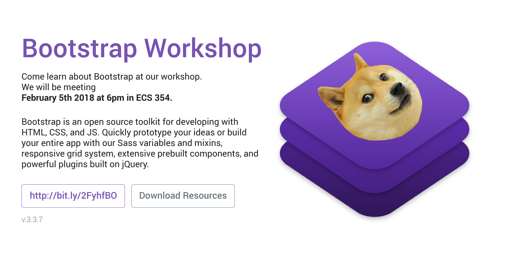

# Bootstrap Workshop

Presented by UVic Web Design and Development Club

## Getting Started

* [Slides]()
* [Demo Files](./demo)

## What You Will Need

* Laptop
* Terminal
* Text Editor (Atom, Sublime, VS Code)
* Broswer (Chrome, Opera, Firefox)

## Ressources

* [Bootstrap](https://getbootstrap.com)
